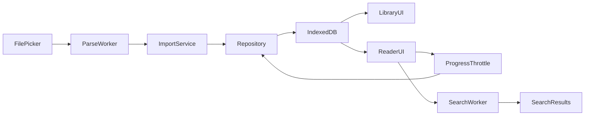

# 技术架构

## 技术选型

- Vite + React + TypeScript strict
- React Router `HashRouter`
- Dexie + IndexedDB
- Zustand（仅临时 UI 状态）
- Web Worker（TXT 解析与全文搜索）
- Vitest + Testing Library
- ESLint
- PakePlus Android 静态文件打包

不使用服务端、远程 API、遥测、运行时 CDN或需要网络的字体。

## 模块

```text
src/
  app/             路由、应用外壳、错误边界
  components/      通用 UI
  features/
    library/       导入、书架、详情和目录
    reader/        阅读、进度、书签、搜索和阅读设置
    settings/      全局设置与存储管理
  data/
    db.ts          Dexie schema 与迁移
    repositories/  数据访问与事务边界
  workers/         TXT 解析与搜索 worker
  lib/             纯函数、格式化、哈希
  styles/          设计令牌与全局样式
```

页面只能调用 repository 或 feature service，不能直接操作 Dexie。Worker 只传输结构化可克隆数据，不持有数据库连接。

## 数据流



### 导入

1. 主线程校验扩展名与大小并读取 `ArrayBuffer`。
2. Worker 检测编码、规范换行、识别章节、计算内容指纹并报告进度。
3. 主线程检查指纹重复。
4. repository 在单个事务写入书籍和章节；失败时不留下半成品。

### 阅读

路由为 `#/reader/:bookId/:chapterIndex`。页面按章节读取正文，使用滚动比例恢复位置。滚动进度每 500 ms 节流写入，并在页面隐藏、章节切换和卸载前强制提交。

### 搜索

搜索按书逐章执行中文子串匹配，Worker 返回章节、位置和上下文片段，并支持请求 ID 取消旧任务。结果数量设上限，避免大结果占满内存。

## 路由

- `#/library`：书架
- `#/books/:bookId`：详情与目录
- `#/reader/:bookId/:chapterIndex`：阅读器
- `#/settings`：设置
- 其他路径重定向到书架

底部导航只在书架和设置显示。详情及阅读器使用层级返回；Android 返回键应先关闭弹层，再返回上级，最后交由系统退出。

## PakePlus 验证门槛

正式功能开发前必须用最小 APK 真机验证：

1. `<input type=\"file\" accept=\".txt,text/plain\">` 能调用 Android 文件选择器并读取内容。
2. Hash 路由在冷启动、刷新和返回键下正确。
3. IndexedDB 在页面切换、进程结束和设备重启后保留。
4. 用同一 application ID 安装新版本后数据保留。
5. `env(safe-area-inset-*)`、软键盘和系统深浅状态栏行为可接受。

如果文件选择失败，优先评估 PakePlus 注入/原生桥；如果 IndexedDB 不稳定，停止功能开发并改用具备可靠文件与 SQLite 插件支持的壳，不能用 localStorage 降级存正文。

## 性能与容量

- TXT 默认上限 50 MiB。
- 解析和搜索不得在主线程执行。
- 章节分页读取，不把整书长期保存在 React 状态中。
- 书架查询不加载章节正文。
- 数据库写入使用事务和批量 `bulkAdd`。

## 安全与隐私

- 设置 CSP，生产构建不允许远程脚本、图片或字体。
- 不记录小说正文；错误日志仅保留技术信息。
- 不请求网络、通讯录、位置等无关权限。
- 文件内容只进入应用私有 IndexedDB。
